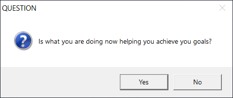

# question

This is one of the simpliest program and smallest programs (2560 bytes) that I have written in C. 
It asks a simple question so you can reflect on how you are using your time. Yes, I am talking about you. 

